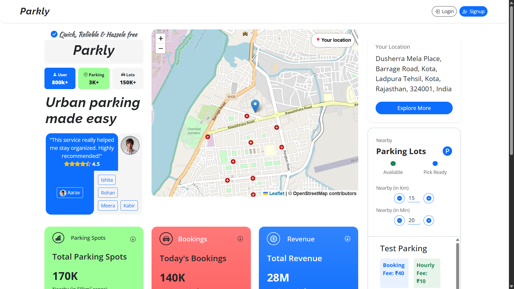
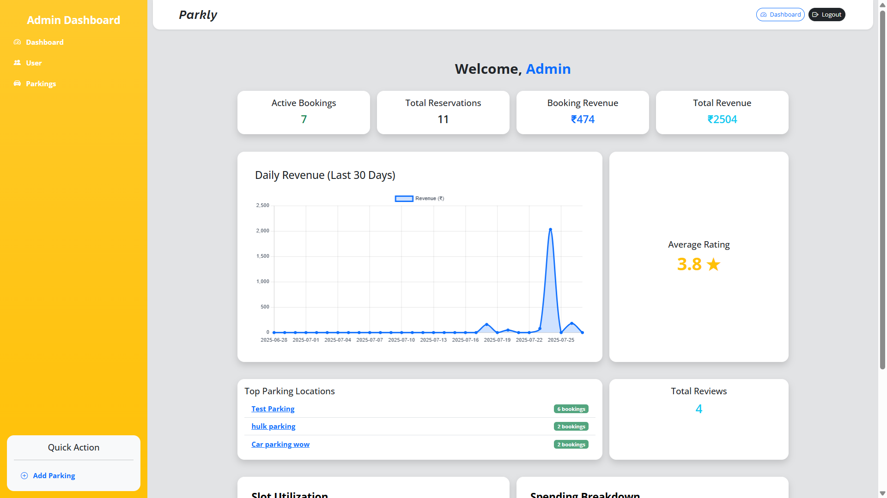
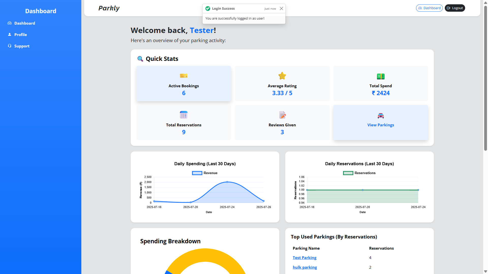
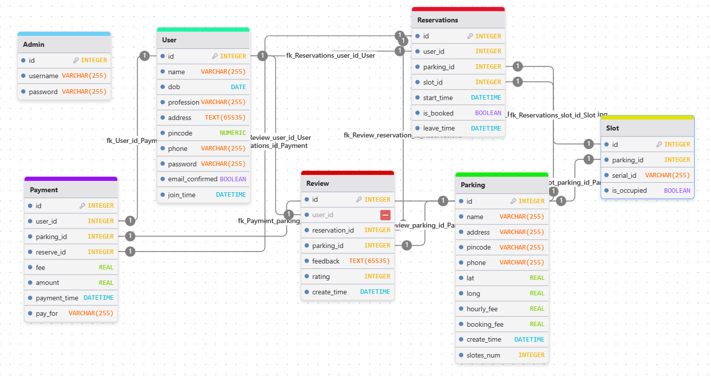

# Parkly: Parking Facility Management App

*Modern Application Development - II Project*  
**Author:** Mohit Raj Rathor

---

## Overview

Parkly is a modern, responsive web app for managing 4-wheeler parking lots. It supports real-time slot booking, user management, payments, reviews, and admin dashboards. Designed for both end-users and administrators to simplify parking operations.

---

## Demo Screenshots

<div align="center">




<div>
<span></span>
<span></span>
</div>

</div>

---

## Tech Stack

- **Backend:** Flask, Flask-SQLAlchemy (SQLite), Celery, Redis
- **Frontend:** Vue.js, Bootstrap
- **APIs:** RESTful, OpenAPI docs, JWT-secured
- **Other Tools:** Leaflet (map view), OpenStreetMap API, Flask-Mail, Git

---

## Features

- User registration with email confirmation
- Admin dashboard for user and parking management
- Real-time slot booking via REST APIs
- Slot CRUD: add, update, delete, manage availability
- Payments, reviews, and ratings
- HTML reports emailed to users/admin
- Daily & monthly jobs using Celery
- Frontend and backend data validation
- Map integration to show parking location
- Caching and background jobs with Redis

---

## Database

Uses **SQLite** (via **Flask-SQLAlchemy**). Schema supports users, parking slots, bookings, payments, reviews, and admin operations. Relationships are normalized for efficient queries and data integrity.

### ER Diagram



---

## Quickstart

### 1. Create .env files

Add to project root:
```env
secret_key=dsvrwsg8v4654vr6rs5gdsvc5746dnivegkl3905u480ei
mail_server=localhost
mail_port=1025
```

Add to `frontend/`:
```env
# frontend
VITE_BASE_URL=http://localhost:1234
```

### 2. Local Setup (Linux/WSL)

```bash
git clone https://github.com/mohitrajrathor/parking_app_v2.git
cd parking_app_v2
chmod +x ./setup.sh ./run.sh
./setup.sh      # Setup project
./run.sh dev    # Start in dev mode
```

> Requires Redis installed. SMTP email runs on `aiosmtpd` locally.

### 3. Docker (Recommended)

```bash
docker compose build --no-cache
docker compose up
```

> Mailhog is used for email testing. No additional setup needed beyond Docker.

---

## API Documentation

Interactive OpenAPI docs available at `/docs/swagger` when the backend is running.

---

## Contributing

Pull requests and issues are welcome! Please open an issue to discuss your ideas or report bugs.

---

## Contact

For questions, contact [mohitrajrathor@gmail.com](mailto:mohitrajrathor@gmail.com).